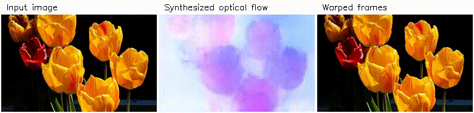
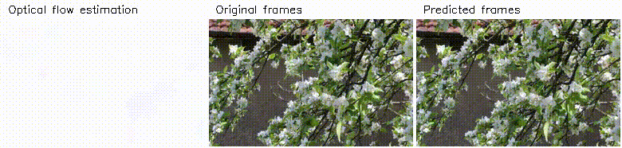

# An implementation of Generative Image Dynamics

An implementation of the diffusion model that generates oscillatory motion for an input image introduced in Generative Image Dynamics [1] and a model that animates the image with the generated motion based on softmax splatting [2].

Updates:

* 2024.07 Added information about training the motion synthesis model in README.

Dependencies:

* Python 3.10.12
* torch 2.3.0
* torchvision 0.18.0
* diffusers 0.28.0
* torchmetrics 1.4.0
* opencv-python 4.8.0
* scipy 1.11.4
* matplotlib 3.7.1
* moviepy 1.0.3 (for writing video files)
* cupy 12.2.0 (for softmax splatting)
* [pyflow](https://github.com/pathak22/pyflow) (for optical flow estimation)

Download trained models:

* https://1drv.ms/u/s!AjGGQwItv34-bK738lmdo7wf2uk?e=cWvbXo

References:

* [1] Zhengqi Li, Richard Tucker, Noah Snavely, and Aleksander Holynski. Generative image dynamics. In Proceedings of the IEEE/CVF Conference on Computer Vision and Pattern Recognition (CVPR), 2024.
* [2] Simon Niklaus and Feng Liu. Softmax splatting for video frame interpolation. In Proceedings of the IEEE/CVF conference on computer vision and pattern recognition, pages 5437–5446, 2020.

Notes:

* The real images and videos in this repo are from Wikimedia Commons.
* The model that animates an image according to optical flow is modified from https://github.com/sniklaus/softmax-splatting. The latent diffusion model for motion synthesis is implemented using the diffusers library. Optical flow is estimated using https://github.com/pathak22/pyflow.

## Generating optical flow from image

Following the paper the motion synthesis model is implemented as a latent diffusion model which consists of a variational autoencoder (VAE) and a U-Net.
It learns to synthesize the temporal FFT of optical flow conditioned on a still image.
The U-Net was trained from scratch and the VAE was taken from [CompVis/ldm-celebahq-256](https://huggingface.co/CompVis/ldm-celebahq-256). The frequency attention layers in the paper were not implemented.

Example:

* In this example the frames are warped by OpenCV remapping, instead of the frame synthesis model described in the next section.

Notes on training the U-Net:

* It was trained on 818 short videos.
  * One or more 150-frame sequences were taken from each video at 30 FPS, resulting in 7218 sequences in total.
  * The contents of these videos are limited to **plants** moving in the wind. I collected them from YouTube by searching plant names, places ("mountain", "meadow", " arboretum"...), seasons, "wind", "tripod", "no looping", etc.
* The optical flow from the first frame to the other frames need to be estimated for each sequence for training the U-Net.
  * I used [pyflow](https://github.com/pathak22/pyflow) with [these parameters](utils/flow.py#L7) to estimate optical flow.
  <!-- * Filtering out large or incorrect motion: -->
  * The training code ([train_unet.py](train_unet.py)) assumes that the estimations are stored as NPY files. I stored them in half-precision to save space.
* I trained the U-Net for around 368K iterations (or 450 epochs with 818 iterations per epoch) using a single L4 GPU and a batch size of 1.

## Generating video from image and optical flow

A frame synthesis model takes an image and a forward flow field to predict a warped image. This model was not implemented following [1], but modified from the model in [2] which uses softmax splatting to warp image features at different resolutions and a GridNet to generate an image from warped features. The model in [1] also uses softmax splatting and a feature pyramid, but the output image is generated by the synthesis network from co-modulation GAN.

Evaluation:

| Method | PSNR &#8593; | SSIM &#8593; | LPIPS (AlexNet) &#8595; |
| --- | --- | --- | --- |
| Model | 36.3127 | 0.9720 | 0.0096 |
| Average splatting | 34.8256 | 0.9657 | 0.0236 |
| OpenCV remapping | 34.7156 | 0.9654 | 0.0132 |

* The model is compared with two baselines average splatting [2] and OpenCV remapping with bicubic interpolation. The model warps multi-scale features while the other methods warp the image directly.
* Evaluation data: 82 frame sequences, 150 frames per sequence, resolution 256x160.

Example:

